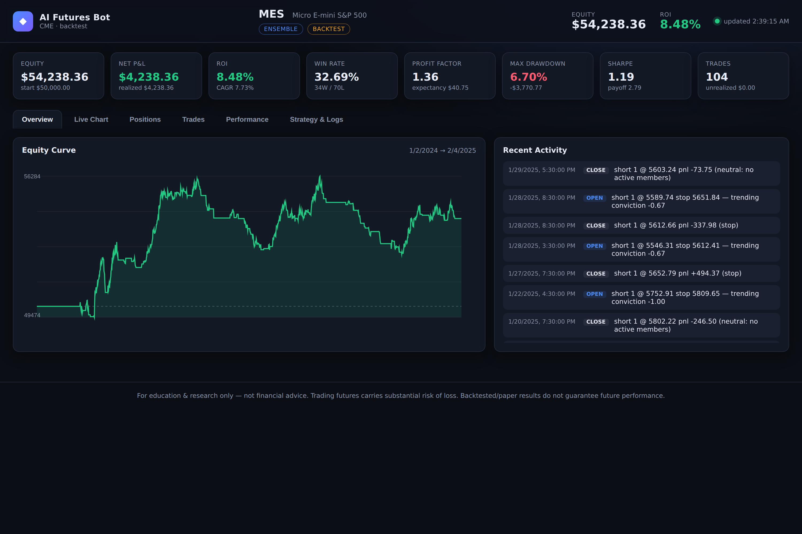
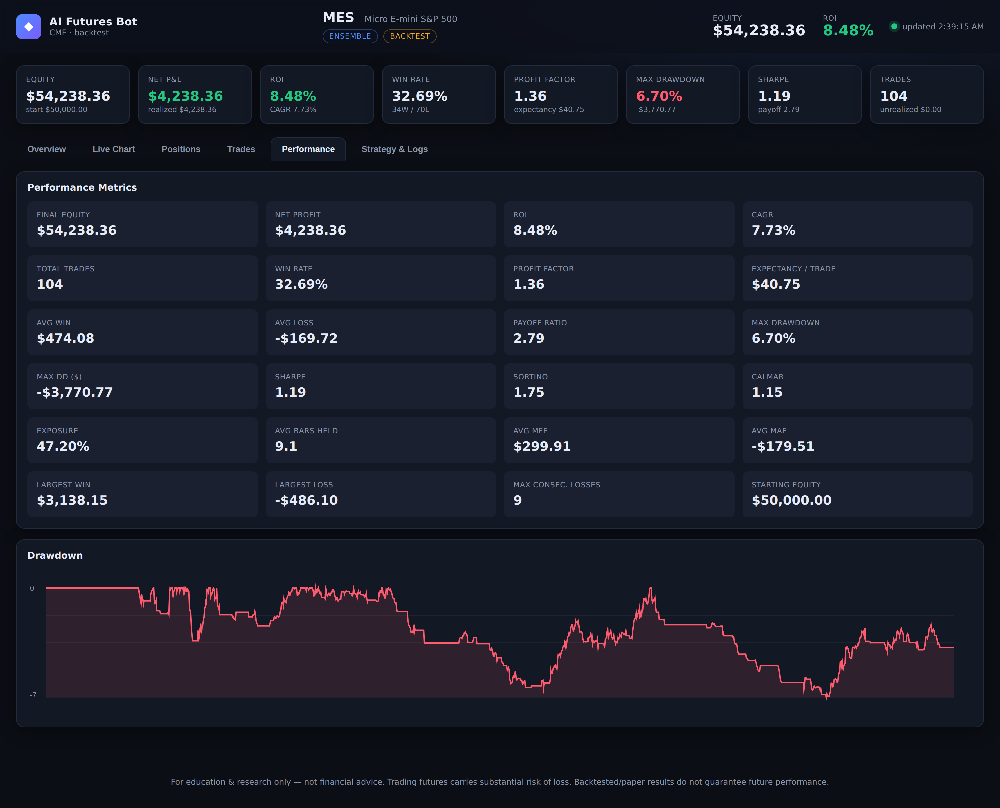

# AI Futures Trading Bot

A modular, research-grounded framework for **backtesting and paper-trading
futures** (E-mini / Micro S&P 500 `ES`/`MES`, Nasdaq `NQ`, crude `CL`, gold
`GC`, and more), with a **professional live dashboard** that embeds TradingView
charts and shows live trades, open positions, PnL, ROI, and win/loss stats.

It ships with six professional strategies (opening-range breakout, VWAP
mean-reversion, Donchian "Turtle" trend following, MACD momentum, Bollinger+RSI
mean-reversion, and an AI/ML ensemble), a volatility-based risk manager with a
daily-loss kill switch, an event-driven backtester, and a paper broker — all
defaulting to a **$50,000 paper account**.

> ⚠️ **For education & research only — not financial advice.** Trading futures
> carries substantial risk of loss and is not suitable for everyone.
> Backtested/paper results do **not** guarantee future performance. There is no
> strategy here (or anywhere) that guarantees profit. Start with the paper
> broker, understand the code, and never risk money you can't afford to lose.

---

## Dashboard preview

The Overview tab — KPI cards, equity curve, and a live activity feed (here the
regime-aware `ensemble` on Micro E-mini S&P 500, hourly):



The Performance tab — full analytics incl. Sortino, Calmar, exposure, MAE/MFE,
and a drawdown chart:



> The numbers above come from a backtest on the bundled **synthetic** feed and
> are illustrative of the UI only — not a representative or expected return. See
> the disclaimer.

## Why this design

- **Zero-dependency core.** Indicators, strategies, risk, backtester, paper
  broker, synthetic data, and the dashboard run on the **Python standard library
  alone** — so it works anywhere and the whole pipeline is testable with no
  network or data downloads.
- **Optional AI layer.** The ML ensemble strategy uses numpy/scikit-learn and
  degrades gracefully if they aren't installed.
- **Backtest == live.** Backtesting and live paper trading share one
  `ExecutionEngine`, so behaviour is identical across both.
- **Risk first.** Position sizing is driven by stop distance and a fixed
  per-trade risk %, with a daily-loss kill switch and a global drawdown halt.

## Quick start

```bash
# 1) (optional) install extras for the ML strategy + config files
pip install -r requirements.txt

# 2) Backtest the default strategy on a $50k account, then open the dashboard
python -m ai_futures_bot.cli backtest --serve
#    → open http://127.0.0.1:8000

# 3) Watch it "trade" live (paper), replaying data fast, dashboard updating live
python -m ai_futures_bot.cli live --strategy opening_range_breakout --speed 0 --serve

# 4) One-liner demo (backtest + dashboard)
python -m ai_futures_bot.cli demo
```

No data files required — a deterministic synthetic feed is generated by default.
Point it at real data with `--csv path.csv` (columns:
`timestamp,open,high,low,close,volume`).

> **Timeframes matter.** Swing/trend strategies (the default `ensemble`,
> `supertrend`, `donchian_trend`, …) run on resampled higher-timeframe bars
> (`--timeframe 60` = hourly) so they don't overtrade minute noise. Intraday
> strategies (`opening_range_breakout`, `vwap_reversion`) want `--timeframe 1`.
> The default contract is **MES** (Micro E-mini S&P 500) — the right size for a
> $50k account; full-size **ES** needs ~$130k+ to trade at 1% risk on swing stops.

### Robustness tooling (what makes it trustworthy)

```bash
# Walk-forward: optimise in-sample, validate out-of-sample (exposes overfitting)
python -m ai_futures_bot.cli walkforward --strategy donchian_trend \
    --grid entry_period=10,20,40 --grid exit_period=5,10 --splits 4

# Grid-search parameters by a risk-adjusted objective
python -m ai_futures_bot.cli optimize --strategy supertrend \
    --grid period=7,10,14 --grid mult=2,3,4 --objective sharpe

# Monte Carlo stress test: probability of profit, risk of ruin, drawdown spread
python -m ai_futures_bot.cli montecarlo --strategy ensemble --simulations 5000
```

## The dashboard

A single-page app served by a stdlib HTTP server, polling a JSON state file the
engine writes. Tabs:

| Tab | What it shows |
|-----|----------------|
| **Overview** | KPI cards (Equity, Net P&L, ROI, Win Rate, Profit Factor, Max DD, Sharpe, Trades) + equity curve + recent activity |
| **Live Chart** | TradingView Advanced Chart widget for the traded symbol (e.g. `CME_MINI:ES1!`) with VWAP & Bollinger studies |
| **Positions** | Current open position (side, qty, entry, stop, target, unrealized) + live risk status |
| **Trades** | Full trade blotter — entry/exit, PnL, return %, exit reason |
| **Performance** | Full metrics grid + drawdown chart |
| **Strategy & Logs** | Active strategy details + a live event log |

The dashboard works for both a finished backtest and a live paper session — same
state shape, written to `runtime/state.json` by default.

## Strategies

| Name | Family | Style |
|------|--------|-------|
| `opening_range_breakout` | Breakout | Intraday |
| `vwap_reversion` | Mean reversion | Intraday |
| `donchian_trend` | Trend following (Turtle) | Swing |
| `macd_momentum` | Momentum + trend filter | Swing |
| `bollinger_reversion` | Mean reversion | Swing |
| `supertrend` | Trend following (ADX-filtered, trailing) | Swing |
| `bollinger_squeeze` | Volatility breakout (TTM squeeze) | Swing |
| `zscore_reversion` | Statistical mean reversion | Swing |
| `ensemble` | **Regime-aware multi-strategy composite (flagship)** | Swing |
| `ml_ensemble` | AI/ML (RandomForest + GradientBoosting) | Swing |

See **[STRATEGIES.md](STRATEGIES.md)** for the exact rules and the research
sources behind each one. List them anytime:

```bash
python -m ai_futures_bot.cli list-strategies
python -m ai_futures_bot.cli list-contracts
```

## The AI/ML strategy

```bash
# Train and save an ensemble model
python -m ai_futures_bot.cli train --days 180 --out runtime/model.pkl

# Backtest using the saved model
python -m ai_futures_bot.cli backtest --strategy ml_ensemble \
    --set model_path=runtime/model.pkl --serve
```

The ensemble predicts P(price higher in *H* bars) from technical features and
trades when confidence clears a threshold. To avoid look-ahead it trains on the
first part of the data and trades the held-out remainder. **This is a teaching
implementation** — production use needs walk-forward retraining, purged CV, and
realistic costs. See the caveats in STRATEGIES.md.

## Risk management

Configured in `risk:` (see `examples/sample_config.yaml`) and enforced in
`risk.py`:

- `risk_per_trade` — fraction of equity risked per trade (default `0.01`).
- Position size = `floor(risk_$ / (stop_points × point_value))`.
- `daily_loss_limit` — halt for the session past this loss (default `0.03`).
- `max_drawdown_stop` — halt entirely past this drawdown (default `0.20`).
- Caps on contracts and margin utilisation; ATR scales stops and size.

## Configuration

Everything can be set in YAML and overridden on the CLI:

```bash
python -m ai_futures_bot.cli backtest \
  --config examples/sample_config.yaml \
  --symbol MES --strategy macd_momentum --balance 50000 \
  --set trend_period=100 --set atr_stop_mult=3.0 --serve
```

## Going live with a real broker

`broker/ib.py` is an Interactive Brokers adapter (via `ib_insync`) — the
real-execution surface. It is **not** used by the default paper workflow. To use
it you must `pip install ib_insync`, run TWS or IB Gateway with the API enabled,
and connect to the **paper** port (7497) first. Trading real money is entirely
at your own risk; validate everything against the simulator before risking a
cent.

## Programmatic use

```python
from ai_futures_bot.backtester import Backtester
from ai_futures_bot.contracts import get_contract
from ai_futures_bot.data import SyntheticDataGenerator
from ai_futures_bot.risk import RiskConfig, RiskManager
from ai_futures_bot.strategies import get_strategy

spec = get_contract("ES")
bars = SyntheticDataGenerator(seed=7).generate(days=90)
strategy = get_strategy("donchian_trend", entry_period=20, exit_period=10)
risk = RiskManager(config=RiskConfig(risk_per_trade=0.01))
result = Backtester(strategy, spec, risk, starting_cash=50_000).run(bars)
print(result.metrics)
```

See `examples/run_backtest.py`.

## Project layout

```
ai_futures_bot/
  contracts.py        Futures contract specs (tick size/value, margins)
  indicators.py       SMA/EMA/RSI/MACD/Bollinger/ATR/VWAP/Donchian/Supertrend/ADX/Keltner/z-score
  data.py             Bar model, CSV loader, synthetic generator, timeframe resampling
  strategies/         Ten strategies (incl. regime ensemble) + base class + registry
  risk.py             Position sizing, daily-loss kill switch, drawdown halt
  portfolio.py        Position/Trade accounting, PnL, costs, slippage, MAE/MFE
  engine.py           Shared per-bar execution engine (backtest == live), trailing stops
  backtester.py       Event-driven backtest driver
  live.py             Streaming paper trader (writes dashboard state)
  metrics.py          ROI, win rate, profit factor, Sharpe, Sortino, Calmar, exposure, ...
  walkforward.py      Walk-forward out-of-sample validation
  optimize.py         Grid/random parameter search
  montecarlo.py       Monte Carlo trade-bootstrap (risk of ruin, drawdown distribution)
  state.py            Dashboard state snapshot + atomic JSON read/write
  broker/             Broker interface, PaperBroker, Interactive Brokers adapter
  ml/                 Feature engineering + ensemble model (optional)
  dashboard/          Stdlib HTTP server + tabbed single-page UI (TradingView)
  config.py, cli.py   Config loading + command-line interface
examples/             Sample config + runnable example
tests/                pytest suite (indicators, risk, engine, metrics, ML, ...)
```

## Testing

```bash
pip install pytest
python -m pytest
```

## Roadmap / ideas

- Walk-forward retraining + purged cross-validation for the ML strategy.
- Multi-symbol portfolios and correlation-aware risk.
- Live data feeds (IB market data, websocket bar aggregation).
- Parameter optimisation and regime detection.

---

**Disclaimer.** This project is provided as-is for educational purposes. It is
not investment advice. The authors accept no liability for any financial loss.
Trading futures is risky; most retail traders lose money. Do your own research.
